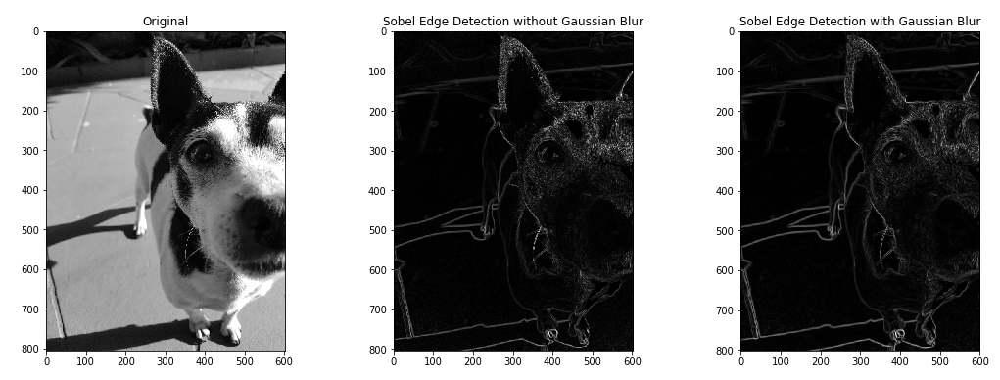

# Convolutions-e-Edge-Detection-em-Numpy
Implementação de um filtro de edge detection com convoluções em Numpy.

## Convoluções 
Uma convolução é uma operação que utiliza um filtro. Um filtro (as vezes chamado de kernel) é uma pequena janela com valores que "caminha" ao longo dos pixels da imagem, realizando operações de produto entre os valores do filtro e os valores da imagem.

Esse código utiliza um filtro de Gaussian Blur e Sobel Edge Detection em imagens.
### Filtro Sobel
O Filtro Sobel é um filtro de detecção de contornos nas imagens. Ele primeiro realiza uma detecção de contornos verticais (Gy) e horizionais (Gx) separadamente. Após a aplicação dos filtros para essas duas orientações de contornos, calcula a norma ou magnitude G resultante de Gx e Gy.

Este código também compara um Filtro Sobel sem a aplicação de um desfoque Gaussiano anteriormente. A aplicação de um desfoque antes da aplicação de um Filtro Sobel pode diminuir o ruído captado pela detecção de contornos, realmente capturando só os contornos mais predominantes.

